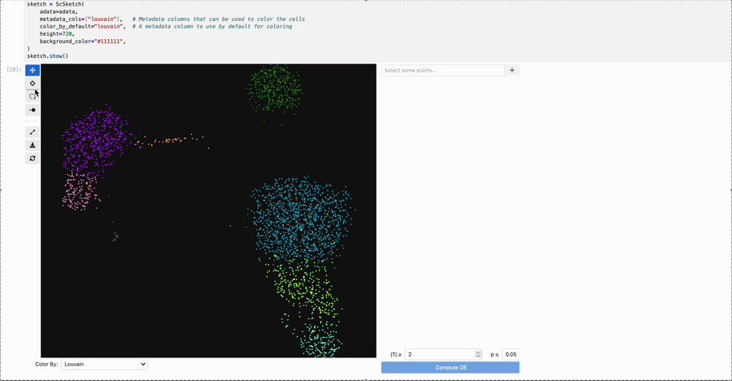
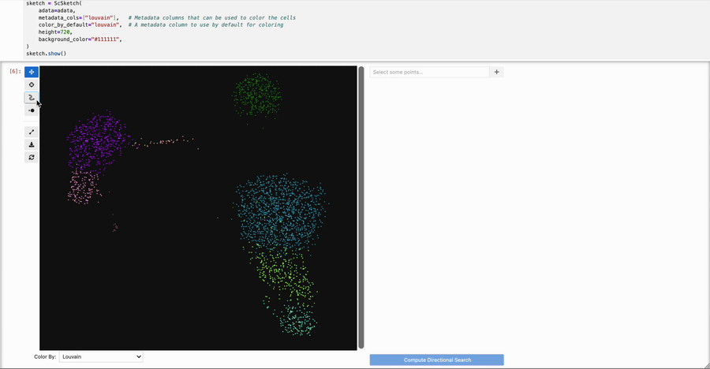

# scSketch project

scSketch is an interactive exploration tool of single-cell embeddings (UMAP, tSNE, etc.) for Python notebooks. It is based on the [jupyter-scatter widget](https://jupyter-scatter.dev/) by [Fritz Lekschas](https://lekschas.de/) and it reimplements the earlier [SciViewer visualizer](https://github.com/colabobio/sciviewer).

<p align="center">
  
</p>
<p align="center">
  <em>Directional sketch → compute directional analysis → click a gene for pathway context.</em>
</p>

<p align="center">
  
</p>
<p align="center">
  <em>Select two groups → compute differential expression → browse results.</em>
</p>

## Usage

### Quick Start

The easiest way to try scSketch is with the built-in demo (no installation required):

```bash
uvx scsketch demo
```

This single command will automatically install scSketch and all dependencies, then launch the demo notebook.

Alternatively, if you've cloned the repository, you can run the demo notebook directly with juv:

```bash
git clone https://github.com/colabobio/scsketch.git
cd scsketch
uvx juv run demo.ipynb
```

Then use in any notebook:

```python
from scsketch import ScSketch

sketch = ScSketch(adata=...)
sketch.show()
```

See the demo notebook for more details

### Use scSketch in your own notebook

Install scSketch into the environment backing your Jupyter kernel:

```bash
python -m pip install scsketch
```

Then in a notebook:

```python
import scanpy as sc
from scsketch import ScSketch

adata = sc.read_h5ad("my_data.h5ad")

# scSketch currently reads coordinates from `adata.obsm["X_umap"]`.
# If you have a different embedding (e.g. tSNE), you can copy it into `X_umap`:
# adata.obsm["X_umap"] = adata.obsm["X_tsne"]

sketch = ScSketch(
    adata=adata,
    metadata_cols=["louvain"],   # optional: columns in `adata.obs` for coloring
    color_by_default="louvain",  # optional: which metadata to color by initially
)

# If this isn't the last line in the cell, use: `from IPython.display import display; display(sketch.show())`
sketch.show()
```

**Directional Search: keep brush selections roughly linear**

Directional Search reduces your selection to a 1D “along-the-sketch” axis by projecting cells onto a single direction vector. If your brush selection is very curved, loops back, or spans multiple branches/blobs, that 1D projection can mix multiple directions of variation and produce hard-to-interpret results.

Practical tips:

- Sketch along one clear gradient at a time (a narrow, elongated selection works best).
- If the trajectory bends, split it into multiple shorter selections and compare results.


**Gene IDs vs gene symbols**

scSketch currently uses `adata.var_names` as the gene identifier for display/search. If your `AnnData` uses Ensembl IDs (e.g. `ENSG...`) in `var_names`, you will see Ensembl IDs in the UI.

If you have gene symbols in a column like `adata.var["gene_symbols"]`, you can create a visualization-only copy that displays symbols:

```python
adata_view = adata.copy()
adata_view.var["ensembl_id"] = adata_view.var_names
adata_view.var_names = adata_view.var["gene_symbols"].astype(str)
adata_view.var_names_make_unique()

sketch = ScSketch(adata=adata_view, metadata_cols=["louvain"], color_by_default="louvain")
sketch.show()
```

### Running the original notebook with juv

To run the original inline notebook, first install [juv](https://github.com/manzt/juv) and then call:

```bash
juv run demo.ipynb
```

## Development

This project uses [uv](https://docs.astral.sh/uv/) for development and dependency management.

### Setup

1.  **Clone the repository:**
    ```sh
    git clone https://github.com/colabobio/scsketch.git
    cd scsketch
    ```

2.  **Sync environment (installs dependencies):**
    ```sh
    uv sync
    ```

### Development Workflow

You can run commands inside the project's environment using `uv run`.

*   **Launch Jupyter Lab for testing:**
    ```sh
    uv run jupyter lab
    ```
    Open `debug.ipynb` to test changes.

*   **Hot-reloading JS/CSS:**
    The `debug.ipynb` notebook is pre-configured with `ANYWIDGET_HMR=1`.
    Any changes you save to files in `src/scsketch/static/` will legally update the widget in your browser without reloading the page.

*   **Linting (Ruff):**
    ```sh
    uv run ruff check .
    ```

*   **Testing:**
    Run the unit test suite with `pytest`:
    ```sh
    uv run pytest tests/
    ```

### Optional: Manual Activation

If you prefer to activate the environment in your shell:
```sh
source .venv/bin/activate
# Now you can use `jupyter`, `python`, `pip` directly
jupyter lab
```

Or with editable installs:

```sh
python -m venv .venv
source .venv/bin/activate
python -m pip install -e ".[dev]"
jupyter lab demo.ipynb
```

### Debugging with VS Code

To debug the Python side of your widgets step-by-step:

1.  **Debugging Jupyter Notebooks:**
    *   Open `debug.ipynb` in VS Code.
    *   Click the **"Select Kernel"** button at the top right and select your project environment (e.g., `.venv` or the one created by `uv`).
    *   You can set breakpoints directly in the notebook cells or in the python files (`src/scsketch/widgets/*.py`).
    *   To debug code in external files (like the widgets), use the **"Debug Cell"** option (often found in the dropdown menu next to the run button of a cell).

2.  **Attaching to a running kernel:**
    If you prefer using `jupyter lab` in your browser but want to debug Python code in VS Code:
    *   Run `jupyter lab` (e.g., `uv run jupyter lab`).
    *   Add this code to a cell at the beginning of your notebook:
        ```python
        import debugpy
        debugpy.listen(5678)
        print("Waiting for debugger attach...")
        debugpy.wait_for_client()
        print("Debugger attached")
        ```
    *   In VS Code, go to the **Run and Debug** view (Ctrl+Shift+D).
    *   Select **"Python: Attach to Local Process"** from the dropdown and click the Play button.
    *   VS Code will attach to your running kernel, and you can now use breakpoints in your local Python files.

### Debugging Frontend (JavaScript)

Since the widgets run in the web browser (or VS Code's webview), you need to use browser developer tools to debug the JavaScript code (`src/scsketch/static/*.js`).

1.  **Run the widget:** Open `debug.ipynb` and run the cell that displays the widget.
2.  **Open Developer Tools:**
    *   **In Browser (Jupyter Lab):** Right-click anywhere on the page > **Inspect**.
    *   **In VS Code:** Open the command palette (`Cmd+Shift+P`) and run **"Developer: Open Webview Developer Tools"**.
3.  **Find your source:**
    *   Go to the **Sources** tab in the developer tools.
    *   Use `Cmd+P` (Mac) or `Ctrl+P` (Windows/Linux) to search for your file (e.g., `correlation_table.js`).
    *   *Note: Because of how modules are loaded, the file path might look like `localhost:xyz/.../correlation_table.js`.*
4.  **Set Breakpoints:** Click on the line number in the JS file to set a breakpoint.
5.  **Trigger the code:** Interact with the widget in the notebook. The debugger will pause on your breakpoint, allowing you to inspect variables and step through the code.

### Publish a New Version

To bump the version use one of the following commands:

1. `uvx bump-my-version bump minor` (e.g., v0.1.0 → v0.2.0)
2. `uvx bump-my-version bump patch` (e.g., v0.1.0 → v0.1.1)
3. `uvx bump-my-version bump major` (e.g., v0.1.0 → v1.0.0)

Afterward do `git push --follow-tags`. Github actions will handle the rest.
